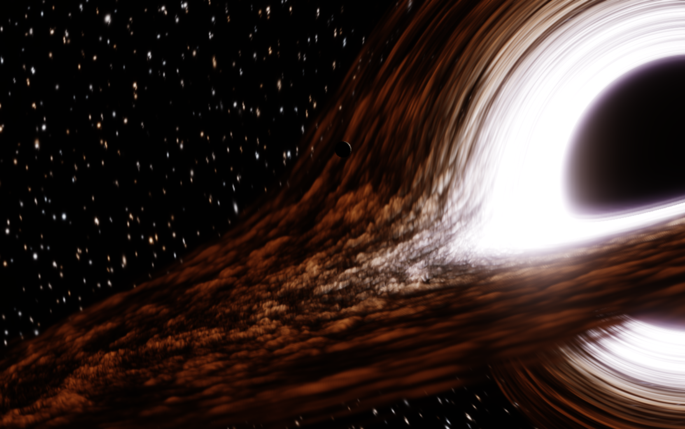

# Kerr Studio

Orbit a spinning Kerr black hole in the browser. Null geodesics run in WebGL2 fragment shaders (RK4). The disk shows frequency shift, and the stars follow the bent escape rays.

This started as the hero sky in a portfolio site, then grew into its own studio and copyable kit.



## Run

```bash
npm install
npm run dev
```

Open [http://localhost:3002](http://localhost:3002).

```bash
npm run build
```

For Vercel, point at the repo root (`vercel.json` sets the build). Relative asset URLs work at the site root.

## Controls

| Tab | What it changes |
| --- | --- |
| Camera | Distance, elevation, azimuth, roll, film, frame shift |
| Disk | Frequency shift (`off` / `color` / `color+bright`), temperature, radiance, thickness, radii, density, swirl, contrast |
| Physics | Spin **a**, charge, animation speed, volume steps, starfield warp |
| Optics | Exposure, glow, stars, haze, vignette, chromatic aberration, quality |
| Presets | Default, Closer, Quiet disk |

Keyboard: `H` HUD, `Space` pause, `S` snapshot, `R` reset. Drag to orbit. Wheel to zoom (16M–250M).

Default look is [`src/kit/look.json`](./src/kit/look.json) (the frame above). Starfield warp defaults to `0.15`. Quiet disk turns frequency shift off.

## Kit

Copy [`src/kit/`](./src/kit/README.md) into another project. That folder is the engine, shaders (including shared `trace.glsl`), and `look.json`.

| Pass | File | Role |
| --- | --- | --- |
| Field | `field.frag` | Disk velocity and density field |
| Geodesic | `geodesic.frag` + `trace.glsl` | Kerr null geodesics |
| Adaptive | `adaptive.frag` + `trace.glsl` | Edge refinement on the lens map |
| Volume | `volume.frag` | Disk plasma, frequency shift, stars |
| Bloom | `blur.frag` | Separable bloom |
| Composite | `composite.frag` | ACES tonemap |

Studio download JSON writes the same shape as `look.json`.

## How it thinks

1. **Coarse geodesic pass** — for each coarse pixel, integrate a null geodesic in Kerr–Newman with RK4 (`trace.glsl`). Store disk hits and escaped sky rays.
2. **Adaptive upsample** — reconstruct coherent neighborhoods onto the full lens map; if curvature / image-order / ray direction disagree, **re-trace that pixel** (never nearest-neighbor edges).
3. **Volume** — march plasma along the hit maps (frequency shift, density, swirl), then sample the bent starfield from escape rays.
4. **While moving** — display pose updates every frame; lens rebuilds throttle (~30 Hz) so orbit feels smooth without rebuilding geodesics every rAF.
5. **On settle** — progressive scissor strips polish the lens map to full geodesic quality.

## Physics notes

Kerr–Newman in Boyer–Lindquist coordinates with **M = 1** (EM charge **Q** optional; default look uses **Q = 0**, i.e. Kerr):

```
Σ = r² + a² cos²θ
Δ = r² − 2r + a² + Q²
```

- Outer horizon: **r₊ = 1 + √(1 − a² − Q²)** (requires **a² + Q² ≤ 1**)
- Null geodesics conserve energy **E**, angular momentum **L_z**, and Carter’s constant **Q_C** (local `carterQ` in `trace.glsl`; not the EM charge `uCharge`)
- Camera rays are projected with a ZAMO-style local frame before integration
- Disk **inner radius** defaults to **prograde photon orbit + 0.1M** (visual ring), not the ISCO
- Disk frequency shift uses a **ZAMO-frame** treatment: prograde Kepler speed relative to ZAMO, SR Doppler in that frame, then gravitational redshift via the ZAMO lapse α = √(Δ Σ / A) (equatorial disk). This approximates `g = E / (−u·p)` for circular emitters; it is not a full null-geodesic invariance factor along each ray:

```
ν₊ = (r² − 2a√r + a²) / (√Δ (r^{3/2} + a))
D_SR ≈ √(1 − v²) / (1 + v · n)
g ≈ α D_SR ,   α = √(Δ Σ / A) ,   Σ = r² ,   A = (r²+a²)² − a² Δ   (θ = π/2)
```

Spin **a**, charge **Q**, geodesic integration, and the ZAMO frequency-shift model above are physical. Glow, haze, bloom, and starfield warp are presentation grades.

Full audit with citations: [`docs/physics-accuracy.md`](./docs/physics-accuracy.md).

## License

MIT © [Dhruv Sharma](https://github.com/vasubawa)
